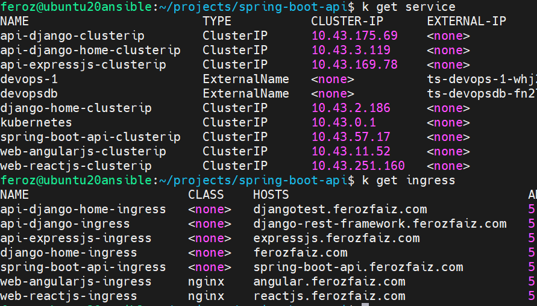

# Spring Boot API

## About the Project

I developed this Spring Boot API, relying on PostgreSQL as the primary database. It is secured through OpenID Connect, leverages Hashicorp Vault for secret management, and is deployed on a self-managed Kubernetes cluster. Additionally, I designed and implemented a [materialized path](https://github.com/nartix/spring-boot-api/tree/main/src/main/java/com/ferozfaiz/common/tree) data hierarchy for use with Spring Data JPA, based on the Python Treebeard package.

Live Demo: <a href='https://spring-boot-api.ferozfaiz.com/swagger-ui.html' target='_blank'>spring-boot-api.ferozfaiz.com</a>

## Features

- **Spring Boot Web & Data Rest**: REST endpoints
- **Spring Security & OAuth2**: Authentication & authorization
- **Spring Data JPA**: Database access via PostgreSQL
- **Spring Vault**: Secret management via HashiCorp Vault
- **OpenAPI (SpringDoc)**: Auto-generated API docs
- **Liquibase**: Database migrations

## Spring Framework Packages

- **Spring Boot Starters**:
    - `spring-boot-starter-web`
    - `spring-boot-starter-actuator`
    - `spring-boot-starter-data-jpa`
    - `spring-boot-starter-security`
    - `spring-boot-starter-data-rest`
    - `spring-boot-starter-validation`
    - `spring-boot-starter-oauth2-client`
    - `spring-boot-starter-oauth2-resource-server`
    - `spring-boot-starter-oauth2-authorization-server`
    - `spring-boot-starter-cache`

- **Spring Cloud**:
    - `spring-cloud-starter-vault-config`

- **Spring Session**:
    - `spring-session-jdbc`

## Other Key Dependencies

- **Database & Migrations**: `postgresql`, `liquibase-core`
- **API Docs**: `springdoc-openapi-starter-webmvc-ui`

## Kubernetes

